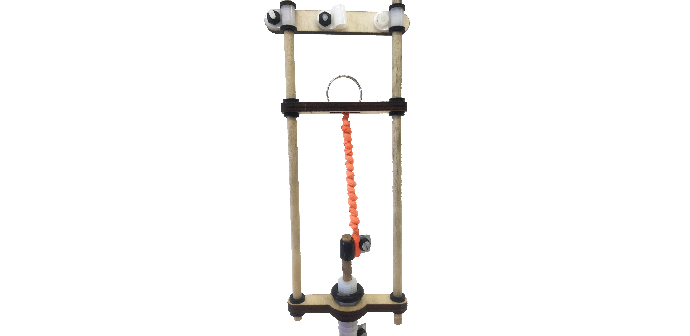

## Reconfigurable Rig

<<<<<<< HEAD

=======

>>>>>>> origin/master
  
  
This is a reconfigurable KAP rig designed to be compatible with kites, balloons, and poles. 

<<<<<<< HEAD

=======

>>>>>>> origin/master

It features a rubber band powered pan mechanism which uses a pipe fitting filled with silly putty as resistance, inspired by a design by Simon Harbord.

